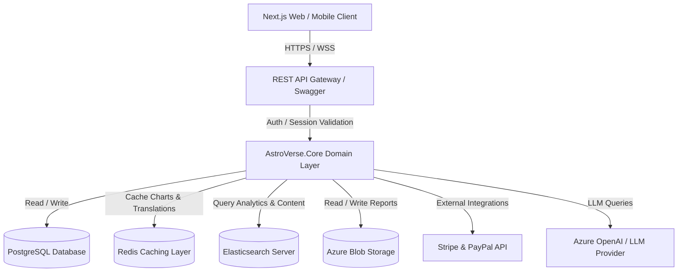

# AstroVerse - System Architecture Design

This document details the architectural structure of the **AstroVerse** Single-Tenant SaaS Astrology Platform, incorporating clean architecture principles, modern web design patterns, and deployment configurations.

---

## 1. High-Level System Architecture

AstroVerse implements a decoupled frontend-backend model with a containerized ecosystem, optimized for high performance, caching, and future multi-tenancy.

---

## 2. Technology Stack Selection

- **Frontend Client**: Next.js 14 (App Router) + TypeScript + Tailwind CSS + Radix UI / ShadCN components.
- **Backend API Server**: .NET 9 Web API (.NET 9.0 SDK, built-in rate-limiting, output caching, JSON serialization).
- **Relational Database**: PostgreSQL (configured for spatial queries to calculate coordinates, timezones, and audit trails).
- **Caching & Pub/Sub**: Redis (Session management, transit prediction caches, and localized translation keys).
- **Authentication**: JWT (JSON Web Tokens) with RS256 signing, supporting OAuth2 social providers.
- **Storage**: Local filesystem abstraction for development, mapping to Azure Blob Storage / AWS S3 for production.

---

## 3. Backend Architecture: Clean Architecture Layers

The backend codebase is structured into three projects inside the C# solution to ensure separation of concerns and testability:

### 3.1. `AstroVerse.Core` (Domain & Interfaces)
- **Entities**: Core models (`User`, `Astrologer`, `FamilyMember`, `Kundli`, `Horoscope`, `Appointment`, `Payment`, `Translation`).
- **Interfaces**: Service interfaces (`IAstrologyService`, `IAiAssistantService`, `ITranslationService`, `IPaymentService`, `ICacheService`).
- **DTOs**: Data Transfer Objects for requests and responses.
- **Exceptions**: Domain-specific error handlers.
- **Services**: Local mathematical/astrological engine calculations, including Guna Milan, chart houses calculation, Muhurat rankings, and numerology.

### 3.2. `AstroVerse.Infrastructure` (Data & Integrations)
- **Data Access**: Entity Framework Core 9.0 mapping PostgreSQL tables, configurations, and database migrations.
- **Caching Implementation**: Redis-backed cache utilizing `IDistributedCache` and memory cache fallbacks.
- **External Integration Services**: Stripe checkout simulations, PayPal webhook verification, Azure Blob client wrappers.
- **Identity & Tokens**: JWT token generator, two-factor token handlers.

### 3.3. `AstroVerse.Api` (Presentation & Routing)
- **Controllers**: Thin controllers handling HTTP requests and routing.
- **Middlewares**: Custom exception filter, JWT validation, multi-language context extractor (`Accept-Language` or custom header), and IP-based rate limiting.
- **Configuration**: `Program.cs` registering services and setting up Swagger with versioning.

---

## 4. Frontend Client Architecture

The Next.js frontend is written in TypeScript, using the standard app router:

- **Routing Structure**:
  - `/auth/*`: Login, registration, OTP validation, and recovery.
  - `/dashboard`: General landing page and recent activities.
  - `/vault`: Interactive family tree node layout, profile management, and stored reports.
  - `/astrology/*`: Kundli generation, Matchmaking comparison, Muhurat selector, Baby name filters.
  - `/assistant`: AI Chat console with sidebar selectors for family vault contexts and speech API toggles.
  - `/marketplace`: Astrologer catalog, calendar booking slots, ratings, and video session room mockup.
  - `/admin`: Metrics panel, translations console, content editing, and user permission matrices.

- **Theme System**: Dynamic Tailwind dark/light classes with CSS variable tokens mapping to custom cosmic themes (deep blues, gold accents, and high-opacity glassmorphism cards).
- **Localization Integration**: Custom context provider fetching translation keys from the backend and loading them client-side.
