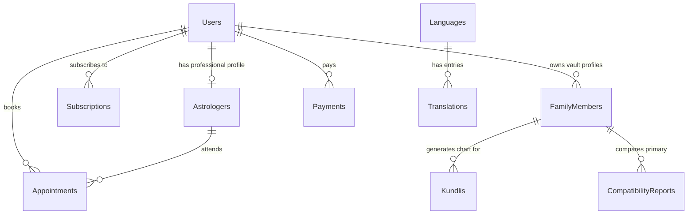

# AstroVerse - Database Design & Schema Specification

This document details the PostgreSQL relational database schema for the AstroVerse platform. It includes column specifications, data types, indexes, auditing patterns, and future multi-tenant ready indicators.

---

## 1. Schema Diagram Overview

The relational structure highlights user profiles, family members, reports, transactions, and translations.

---

## 2. Table Schemas & Definitions

### 2.1. `Users` Table
Holds core identity details for both customers and staff.

| Column | Type | Constraints | Description |
| :--- | :--- | :--- | :--- |
| `Id` | UUID | PRIMARY KEY | Unique identifier (v4) |
| `TenantId` | UUID | NULLABLE | Multi-tenancy future-ready key |
| `Email` | VARCHAR(255) | UNIQUE, NOT NULL | Primary login email |
| `PasswordHash` | VARCHAR(255) | NULLABLE | Hashed password (null for OAuth users) |
| `Role` | VARCHAR(50) | NOT NULL | `SuperAdmin`, `Admin`, `Astrologer`, `User` |
| `FullName` | VARCHAR(255) | NOT NULL | User's full name |
| `PhoneNumber` | VARCHAR(50) | NULLABLE | Contact phone |
| `IsEmailVerified`| BOOLEAN | DEFAULT FALSE | Email verification flag |
| `TwoFactorEnabled`| BOOLEAN | DEFAULT FALSE | MFA status flag |
| `TwoFactorSecret`| VARCHAR(128) | NULLABLE | MFA TOTP secret token |
| `CreatedAt` | TIMESTAMPTZ | DEFAULT NOW() | Timestamp of registration |
| `UpdatedAt` | TIMESTAMPTZ | DEFAULT NOW() | Timestamp of modification |

---

### 2.2. `Astrologers` Table
Extends the `Users` table with professional metadata.

| Column | Type | Constraints | Description |
| :--- | :--- | :--- | :--- |
| `Id` | UUID | PRIMARY KEY | Unique identifier |
| `UserId` | UUID | UNIQUE, FK -> Users | Reference to User record |
| `Bio` | TEXT | NULLABLE | Professional description |
| `ExperienceYears`| INT | DEFAULT 0 | Years of active practice |
| `Specialties` | VARCHAR(255)[]| NULLABLE | e.g. `['Vedic', 'Vastu', 'Numerology']` |
| `Languages` | VARCHAR(50)[] | NULLABLE | e.g. `['English', 'Hindi', 'Tamil']` |
| `HourlyRate` | DECIMAL(18,2)| DEFAULT 0.00 | Cost per hour of consultation |
| `Rating` | DECIMAL(3,2) | DEFAULT 5.00 | Computed average reviews rating |
| `IsApproved` | BOOLEAN | DEFAULT FALSE | Verified by Admin portal |
| `CreatedAt` | TIMESTAMPTZ | DEFAULT NOW() | Registration date |

---

### 2.3. `FamilyMembers` Table
Core of the **Family Astro Vault**. Holds personal birth configurations.

| Column | Type | Constraints | Description |
| :--- | :--- | :--- | :--- |
| `Id` | UUID | PRIMARY KEY | Unique identifier |
| `TenantId` | UUID | NULLABLE | Tenant key |
| `UserId` | UUID | FK -> Users | Owner profile user |
| `Name` | VARCHAR(255) | NOT NULL | Profile name |
| `Gender` | VARCHAR(20) | NOT NULL | `Male`, `Female`, `Unisex` |
| `RelationType` | VARCHAR(50) | NOT NULL | `Self`, `Spouse`, `Child`, `Sibling`, etc. |
| `DateOfBirth` | DATE | NOT NULL | Solar birth date |
| `TimeOfBirth` | TIME | NOT NULL | Exact wall clock birth time |
| `Latitude` | DECIMAL(9,6) | NOT NULL | Geolocation latitude |
| `Longitude` | DECIMAL(9,6) | NOT NULL | Geolocation longitude |
| `PlaceOfBirth` | VARCHAR(255) | NOT NULL | City and country name |
| `PhotoUrl` | VARCHAR(512) | NULLABLE | Profile picture URL |
| `Tags` | VARCHAR(50)[] | NULLABLE | e.g. `['Immediate', 'BusinessPartner']` |
| `Notes` | TEXT | NULLABLE | Astrological logs or personal notes |
| `CreatedAt` | TIMESTAMPTZ | DEFAULT NOW() | Record creation |

---

### 2.4. `Kundlis` Table
Stores pre-computed charts and planetary details.

| Column | Type | Constraints | Description |
| :--- | :--- | :--- | :--- |
| `Id` | UUID | PRIMARY KEY | Unique identifier |
| `TenantId` | UUID | NULLABLE | Tenant key |
| `FamilyMemberId`| UUID | FK -> FamilyMembers| Link to specific vault member |
| `Rashi` | VARCHAR(50) | NOT NULL | Moon Sign name |
| `Nakshatra` | VARCHAR(50) | NOT NULL | Constellation constellation name |
| `Ascendant` | VARCHAR(50) | NOT NULL | Rising Sign (Lagna) |
| `LagnaChartData`| JSONB | NOT NULL | House coordinates for Lagna chart |
| `NavamsaChartData`| JSONB | NOT NULL | House coordinates for D9 chart |
| `PlanetaryPositions`| JSONB | NOT NULL | Degrees, signs, and retrograde flags |
| `DashaAnalysis` | JSONB | NOT NULL | Mahadasha & Antardasha timeline |
| `Yogas` | JSONB | NOT NULL | Formed astrological Yogas list |
| `Doshas` | JSONB | NOT NULL | Formed Doshas detail (e.g. Manglik status) |
| `CreatedAt` | TIMESTAMPTZ | DEFAULT NOW() | Computed date |

---

### 2.5. `CompatibilityReports` Table
Stores Guna Milan matchmaking scores and details.

| Column | Type | Constraints | Description |
| :--- | :--- | :--- | :--- |
| `Id` | UUID | PRIMARY KEY | Unique identifier |
| `TenantId` | UUID | NULLABLE | Tenant key |
| `PrimaryMemberId`| UUID | FK -> FamilyMembers| First member profile |
| `SecondaryMemberId`| UUID | FK -> FamilyMembers| Second member profile |
| `GunaMilanScore`| DECIMAL(5,2)| NOT NULL | Points out of 36.00 |
| `ManglikStatus` | JSONB | NOT NULL | Comparative Manglik compatibility |
| `DoshaAnalysis` | JSONB | NOT NULL | Bhakoot, Nadi, and Gana dosha details |
| `CompatibilityScore`| DECIMAL(5,2)| NOT NULL | Overall calculated match percentage |
| `Recommendations`| TEXT | NOT NULL | remedies and details |
| `CreatedAt` | TIMESTAMPTZ | DEFAULT NOW() | Date computed |

---

### 2.6. `Subscriptions` Table
Tracks customer subscription status and levels.

| Column | Type | Constraints | Description |
| :--- | :--- | :--- | :--- |
| `Id` | UUID | PRIMARY KEY | Unique identifier |
| `TenantId` | UUID | NULLABLE | Tenant key |
| `UserId` | UUID | FK -> Users | Subscriber user |
| `PlanType` | VARCHAR(50) | NOT NULL | `Free`, `Basic`, `Premium`, `Professional` |
| `Status` | VARCHAR(50) | NOT NULL | `Active`, `Canceled`, `Expired` |
| `StartDate` | TIMESTAMPTZ | NOT NULL | Billing start date |
| `EndDate` | TIMESTAMPTZ | NOT NULL | Expiry threshold |
| `StripeSubscriptionId`| VARCHAR(255)| NULLABLE | Checkout subscription key |
| `CreatedAt` | TIMESTAMPTZ | DEFAULT NOW() | Event date |

---

### 2.7. `Translations` Table
Stores localized strings.

| Column | Type | Constraints | Description |
| :--- | :--- | :--- | :--- |
| `Id` | UUID | PRIMARY KEY | Unique identifier |
| `LanguageCode` | VARCHAR(10) | NOT NULL | Code (e.g. `en`, `hi`, `ar`) |
| `Key` | VARCHAR(255) | NOT NULL | Lookup string key |
| `Value` | TEXT | NOT NULL | Translated text value |

---

## 3. Database Indexing Strategy
To ensure quick queries under heavy loads, the following indexes are defined:
1. `idx_users_email` (B-Tree on `Users(Email)`): Accelerates login lookups.
2. `idx_familymembers_userid` (B-Tree on `FamilyMembers(UserId)`): Quick load of the Vault hierarchy.
3. `idx_translations_code_key` (Unique Hash on `Translations(LanguageCode, Key)`): Rapid lookup of localized content.
4. `idx_kundli_memberid` (B-Tree on `Kundlis(FamilyMemberId)`): Fetches historical chart records quickly.
5. `idx_horoscope_rashi_time` (Composite on `Horoscopes(Rashi, Timeframe, DateOfPrediction, Language)`): Optimizes daily batch prediction retrievals.

---

## 4. GDPR Compliance Measures
- **Right to Be Forgotten**: Users deleting their account triggers cascading deletions across `FamilyMembers`, `Kundlis`, `Subscriptions`, and `Appointments`.
- **Data Portability**: Endpoints are provided to export all family profiles and Kundli details into a structured JSON archive.
- **Audit Trails**: Security actions, permission escalations, and changes to personal records are locked inside `AuditLogs` and cannot be modified.
